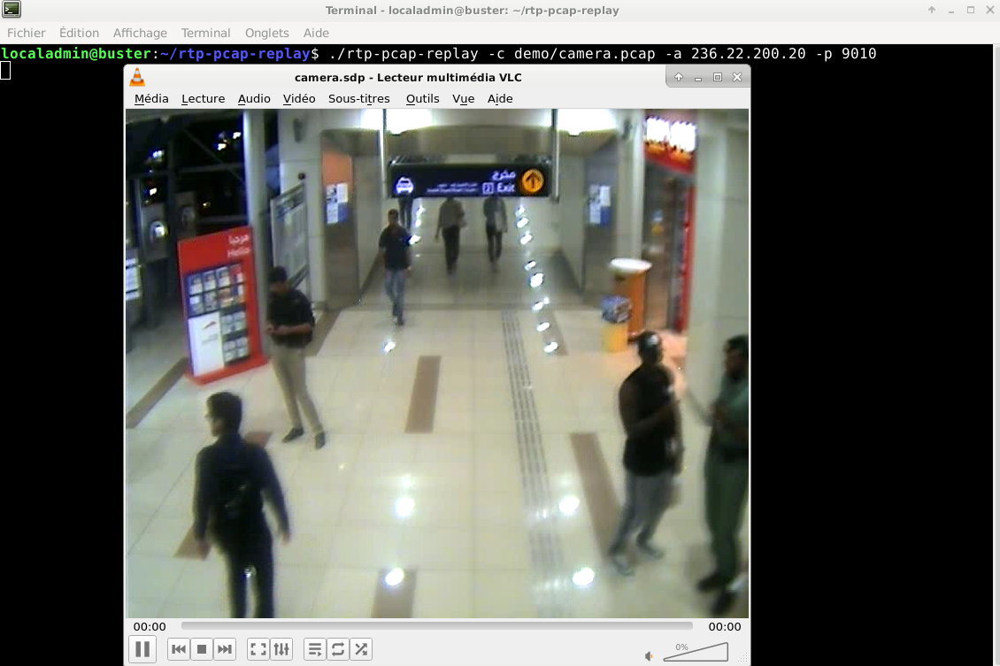

# rtp-pcap-replay

Replays tcpdump capture of RTP streams.

The goal of this program is to replay tcpdump (or wireshark) captures of RTP streams at the pace they were recorded.
The program will stream the packets on a multicast group. I used it used a lot at work to stream video cameras samples.

The program will analyse the RTP packets to stream to guess the RTP time increment between RTP images and get the initial RTP sequence.
It is able to loop over the capture file and stream it forever.
It will fix the time and sequence fields of the RTP header while streaming.

A few video samples are provided with the source code for testing.

This program uses live555 for streaming, and libpcap for reading tcpdump capture files.

This program has been used under cygwin and linux.

## Build instructions

The build instructions target Linux debian (tested on buster and stretch) and Cygwin.

### Installing dependencies

#### debian

rtp-pcap-replay depends on the following packages :

~~~~
sudo apt-get install livemedia-utils liblivemedia-dev libpcap-dev pkg-config
~~~~

#### cygwin

There are no precompiled live555 packages bundled for Cygwin, you will need to compile and install them yourself.
The source code for live555 can be downloaded from 
 * http://www.live555.com/liveMedia/public official live555 source repository
 * https://github.com/rgaufman/live555 which is a guthub mirror of the offical sources

For libpcap, you will need to download the libwpcap installer from https://www.winpcap.org/. 

### Building

#### debian

The makefile supplied is debian targeted and should work as is.

~~~~
make build
sudo make install
~~~~

#### cygwin

Assuming live555 has been compiled and installed in /usr/local and winpcap has been installed in ./winpcap :

~~~~
g++ -g3 rtp-pcap-replay.cpp -o rtp-pcap-replay -I/usr/local/include/groupsock -I /usr/local/include/BasicUsageEnvironment -I /usr/local/include/UsageEnvironment -L/usr/local/lib -I ./winpcap/include -L ./winpcap/Lib -lBasicUsageEnvironment -lUsageEnvironment -lgroupsock -lwpcap -lpacket
~~~~

## Demo and usage

There to videos and an SDP provided for it :

~~~~
localadmin@buster:rtp-pcap-replay$ cat demo/camera.sdp
v=0
m=video 9010 RTP/AVP 96
c=IN IP4 236.22.200.20/255
a=rtpmap:96 MP4V-ES/90000
a=fmtp:96 profile-level-id=3; config=0000012000c488ba9850584121463f;

localadmin@buster:rtp-pcap-replay$ ./rtp-pcap-replay -c ./demo/camera.pcap -a 236.22.200.20 -p 9010 -l 0
~~~~

Now, with VLC open the demo/camera.sdp :

